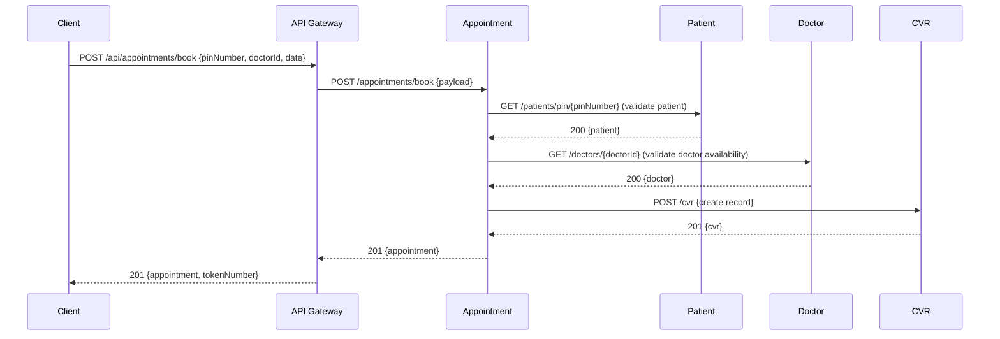

# Hospital Management System — Architecture & Working Flow

**भाषा / Language:** English content with Hindi headings/terms (e.g., "Saaransh (Summary)") ✅

---

## Saaransh (Summary) 🏥
- **Project:** hospital-management-system
- **Architecture:** Microservices (Spring Boot), Eureka service discovery, API Gateway (Spring Cloud Gateway), Feign for inter-service calls
- **Core services:** `eureka` (discovery), `Api-Gateway`, `appointment-service`, `billing-service`, `doctor-service`, `patient-service`, `opd-service`, `cvr-service`, `user-service`

---

## Uchch Star Archtiecture (High-level Architecture) 🔧

Mermaid component diagram (copy into a Mermaid-capable renderer):

```mermaid
flowchart LR
  Client[Client (Web / Mobile)] -->|HTTP / REST| ApiGateway[API Gateway<br/>(Api-Gateway)]
  ApiGateway -->|Routes / LB| Appointment[Appointment Service\n(appointment-service)]
  ApiGateway --> Billing[Billing Service\n(billing-service)]
  ApiGateway --> Doctor[Doctor Service\n(doctor-service)]
  ApiGateway --> Patient[Patient Service\n(patient-service)]
  ApiGateway --> OPD[OPD Service\n(opd-service)]
  ApiGateway --> CVR[CVR Service\n(cvr-service)]
  ApiGateway --> User[User Service\n(user-service)]

  subgraph Discovery
    Eureka[Eureka Server\n(eureka)]
  end

  Eureka <---> Appointment
  Eureka <---> Billing
  Eureka <---> Doctor
  Eureka <---> Patient
  Eureka <---> OPD
  Eureka <---> CVR
  Eureka <---> User

  %% Inter-service calls
  Appointment -->|Feign: PATIENT-SERVICE| Patient
  Appointment -->|Feign: DOCTOR-SERVICE| Doctor
  Appointment -->|Feign: CVR-SERVICE| CVR
  CVR -->|Feign: PATIENT-SERVICE| Patient
  Billing -.->|calls| Patient
```

> Note: The mermaid code above is provided as an editable diagram block. For Word/PDF, render to PNG and embed if you prefer visual images.

---

## Kriya Paddhati (Working Flow) 🔁

### Example: Book Appointment (Sequence)



---

## Pratyek Seva (Per-service responsibilities) 🧩
- **Eureka (eureka)** — Service registration & discovery
- **Api-Gateway (Api-Gateway)** — Routing, CORS, global filters, Swagger aggregation
- **Appointment Service (appointment-service)** — Book appointments, manage tokens, appointment lifecycle (checkin, start/complete consultation), uses Feign clients to call `patient-service`, `doctor-service`, `cvr-service`
- **Billing Service (billing-service)** — Invoices and payments (create invoice, pending invoices, process payments)
- **Doctor Service (doctor-service)** — Doctor registry, schedules, availability, search
- **Patient Service (patient-service)** — Patient registration, medical history, search, existence checks
- **OPD Service (opd-service)** — Queue, consultations, prescriptions, OPD workflows
- **CVR Service (cvr-service)** — Clinical visit records (CVR), vitals, assign doctor, status updates, uses `patient-service` for patient details
- **User Service (user-service)** — Authentication, user profiles, roles

---

## Endpoint Summary (Quick reference) 🗂️

### Appointment Service (`/appointments`)
- POST /appointments/book — Book appointment
- GET /appointments/{appointmentId} — Get appointment
- PUT /appointments/{appointmentId}/checkin — Check-in
- PUT /appointments/{appointmentId}/start-consultation
- PUT /appointments/{appointmentId}/complete-consultation
- POST /appointments/cancel, /appointments/reschedule
- GET /appointments/patient/{pinNumber}

### Patient Service (`/patients`)
- POST /patients/register
- GET /patients/pin/{pinNumber}
- PUT /patients/{pinNumber}
- GET /patients/{pinNumber}/medical-history
- PUT /patients/{pinNumber}/medical-history
- GET /patients/search, /patients/contact/{contactNumber}

### Doctor Service (`/doctors`)
- POST /doctors/register
- GET /doctors/{doctorId}
- PUT /doctors/{doctorId}, /doctors/{doctorId}/status
- GET /doctors/available, /doctors/available/specialization/{specialization}
- GET /doctors/specializations, /doctors/departments

### CVR Service (`/cvr`)
- POST /cvr — Create CVR
- GET /cvr/{cvrNumber}
- PUT /cvr/{cvrNumber}/checkin, /start-consultation, /complete-consultation
- POST /cvr/vitals/record
- PUT /cvr/{cvrNumber}/assign-doctor

### Billing Service (`/billing/*`)
- POST /billing/invoices/create
- GET /billing/invoices/{invoiceNumber}
- GET /billing/payments/invoice/{invoiceNumber}
- POST /billing/payments/process/{invoiceNumber}

### OPD (`/opd/*`) — queues, consultations, prescriptions (see `OpdServiceApplication` controllers)

> For full endpoint details, I can extract every controller method and add them as per-service endpoint tables.

---

## Inter-service calls (Feign clients) 🔗
- **appointment-service** → `PATIENT-SERVICE` (get patient by PIN, exists check)
- **appointment-service** → `DOCTOR-SERVICE` (get doctor by id, schedule by date)
- **appointment-service** → `CVR-SERVICE` (create CVR record, get CVR)
- **cvr-service** → `PATIENT-SERVICE` (get patient details)

---

## Run & Dev notes (Chalana aur vikas) 🔧
1. Start `EurekaServerApplication` (port 8761 by default)
2. Start `ApiGatewayApplication` (port 8080)
3. Start microservices: `patient-service`, `doctor-service`, `appointment-service`, `cvr-service`, `billing-service`, `opd-service`, `user-service`
4. Build: `mvn -f pom.xml clean package -DskipTests` (root or module)
5. Health endpoints: `/actuator/health` (if actuator enabled)

---

## Agla Kadam (Next steps) ✅
- [ ] Add full endpoint table (I can auto-extract every controller to a table)
- [ ] Add sequence diagrams for "Consultation" and "Billing" flows
- [ ] (Optional) Render Mermaid diagrams to PNG and embed in Markdown
- [ ] Convert to `.docx` and `.pdf` (I can run conversion if you allow me to run the conversion step locally here)

---

If this looks good, I will:
1. Add a detailed endpoints table (auto-extracted) and per-service README sections
2. Generate Mermaid sequence diagrams for additional flows
3. Optionally render PNGs and convert the doc to `docs/ARCHITECTURE.docx` and `docs/ARCHITECTURE.pdf` on your confirmation

---

*Document generated automatically by scan of repository controllers and Feign clients.*
